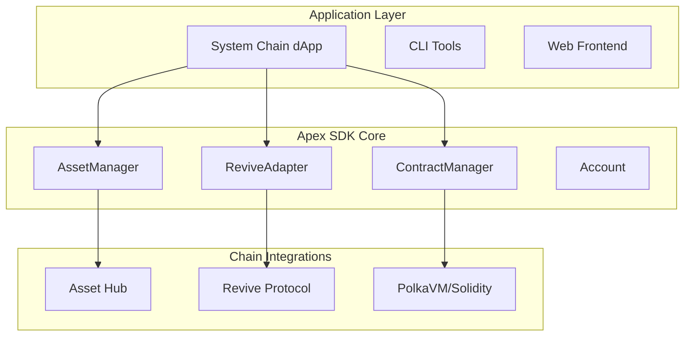

# Architecture Overview: System Chain Standard

Understand the modular architecture and design principles behind Apex SDK as the System Chain Standard Library for Polkadot Asset Hub, Revive, and PolkaVM/Solidity.


## System Design

Apex SDK is a modular, protocol-agnostic library for building system chain applications. The design prioritizes:
- High-level Asset Hub APIs (assets, NFTs, balances)
- Native Revive protocol integration
- PolkaVM/Solidity contract management
- Unified account, transaction, and chain operations

### High-Level Architecture



## Core Components

- **AssetManager** — Asset Hub API (assets, NFTs, balances)
- **ReviveAdapter** — Revive protocol integration
- **ContractManager** — PolkaVM/Solidity contract deployment/calls
- **Account** — Unified account abstraction

### Transaction Management

Unified transaction API for assets, NFTs, and contracts:

```rust
let tx_hash = asset_mgr.transfer(asset_id, from, to, amount).await?;
let contract_result = contract.call_method("transfer", &[recipient, amount]).await?;
```

### Revive Protocol

Native asset recovery and migration:

```rust
let result = revive.recover_asset(account_id, asset_id).await?;
```

## PolkaVM/Solidity Contracts

Deploy and interact with Solidity contracts on Asset Hub:

```rust
let contract = ContractManager::deploy(&bytecode, ContractConfig::default(), &deployer_account).await?;
let result = contract.call_method("transfer", &[recipient, amount]).await?;
```

## Best Practices

- Use async/await for all chain operations
- Modularize dApp logic using AssetManager, ReviveAdapter, ContractManager
- Follow [Security Recommendations](/docs/security) for key management

## Next Steps

- [Quick Start](/docs/quickstart)
- [API Reference](/docs/api)
- [Revive & PolkaVM Guide](/docs/revive)
- [Installation Guide](/docs/installation)

**Ready to build the future of system chain applications?**