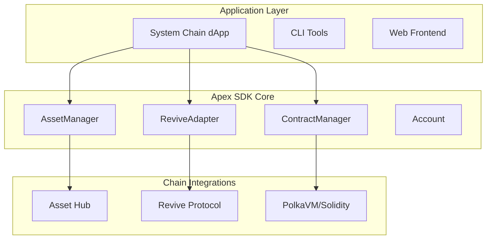

# Architecture Overview: System Chain Standard

Understand the modular architecture and design principles behind Apex SDK as the System Chain Standard Library for Polkadot Asset Hub, Revive, and PolkaVM/Solidity.


## System Design

Apex SDK is a modular, protocol-agnostic library for building system chain applications on Polkadot Asset Hub, Revive, and PolkaVM/Solidity. The design prioritizes:
- High-level Asset Hub APIs (assets, NFTs, balances)
- Native Revive protocol integration
- PolkaVM/Solidity contract management
- Unified account, transaction, and chain operations
- Security, performance, and developer experience


### High-Level Architecture


    subgraph "External Networks"
        K[Ethereum]
        L[Polygon]
        M[Polkadot]
        N[Kusama]
        O[Avalanche]
    end
    
    A --> D
    B --> D
    C --> D
    
    D --> E
    D --> F
    D --> G
    
    E --> H
    E --> I
    F --> H
    F --> I
    G --> H
    G --> I
    
    H --> K
    H --> L
    H --> O
    I --> M
    I --> N
```

## Core Components


### Core Components

- **AssetManager** — Asset Hub API (assets, NFTs, balances)
- **ReviveAdapter** — Revive protocol integration
- **ContractManager** — PolkaVM/Solidity contract deployment/calls
- **Account** — Unified account abstraction


### Account

Unified account abstraction for all system chain operations:

```rust
let account = Account::from_private_key("0x...");
let address = account.address();
```


### Transaction Management

Unified transaction API for assets, NFTs, and contracts:

```rust
let tx_hash = asset_mgr.transfer(asset_id, from, to, amount).await?;
let contract_result = contract.call_method("transfer", &[recipient, amount]).await?;
```


### Revive Protocol

Native asset recovery and migration:

```rust
let result = revive.recover_asset(account_id, asset_id).await?;
```


## Chain Integrations

- **Asset Hub** — Native assets, NFTs, balances
- **Revive Protocol** — Asset recovery, migration
- **PolkaVM/Solidity** — Contract deployment and calls


## PolkaVM/Solidity Contracts

Deploy and interact with Solidity contracts on Asset Hub:

```rust
let contract = ContractManager::deploy(&bytecode, ContractConfig::default(), &deployer_account).await?;
let result = contract.call_method("transfer", &[recipient, amount]).await?;
```


## Security, Performance, and Extensibility

- Secure key management
- Async/concurrent operations
- Modular plugin architecture


## Best Practices

- Store private keys securely
- Use async/await for all chain operations
- Modularize dApp logic using AssetManager, ReviveAdapter, ContractManager

### Key Management

```rust
pub struct SecureKeystore {
    encryption_key: ChaCha20Poly1305,
    storage_backend: StorageBackend,
    access_policy: AccessPolicy,
}

impl SecureKeystore {
    pub fn encrypt_and_store(&self, key: PrivateKey, password: &str) -> Result<KeyId, ApexError> {
        // 1. Derive encryption key from password using Argon2
        // 2. Encrypt private key with ChaCha20-Poly1305
        // 3. Store encrypted key with secure metadata
    }
    
    pub fn retrieve_and_decrypt(&self, key_id: KeyId, password: &str) -> Result<PrivateKey, ApexError> {
        // 1. Retrieve encrypted key and metadata
        // 2. Verify access policy constraints
        // 3. Decrypt and return private key
    }
}
```


## Next Steps

- [Quick Start](/docs/quickstart)
- [API Reference](/docs/api)
- [Asset Hub Integration](/docs/substrate)
- [Revive & PolkaVM Guide](/docs/revive)
- [Installation Guide](/docs/installation)

**Ready to build the future of system chain applications?**

## Error Handling Strategy

### Error Hierarchy

```rust
#[derive(Debug, thiserror::Error)]
pub enum ApexError {
    // Network-level errors
    #[error("Network connection failed: {0}")]
    NetworkError(#[from] NetworkError),
    
    // Protocol-level errors  
    #[error("Transaction failed: {0}")]
    TransactionError(#[from] TransactionError),
    
    // Application-level errors
    #[error("Configuration invalid: {0}")]
    ConfigError(#[from] ConfigError),
    
    // Recovery suggestions
    #[error("Bridge operation failed: {error}. Suggestion: {suggestion}")]
    BridgeError { error: String, suggestion: String },
}
```

### Recovery Mechanisms

```rust
pub trait Recoverable {
    async fn retry_with_backoff(&self, operation: Operation) -> Result<T, ApexError>;
    async fn switch_provider(&self, chain: ChainType) -> Result<(), ApexError>;
    async fn escalate_to_manual(&self, context: ErrorContext) -> ManualIntervention;
}
```

## Configuration Management

### Hierarchical Configuration

Configuration is loaded and merged from multiple sources in priority order:

1. Command line arguments
2. Environment variables
3. Local configuration file (`apex.config.toml`)
4. Global configuration file (`~/.apex/config.toml`)
5. Default configuration

### Configuration Schema

```rust
#[derive(Debug, Clone, Deserialize)]
pub struct ApexConfig {
    #[serde(default)]
    pub project: ProjectConfig,
    
    #[serde(default)]
    pub networks: NetworkConfig,
    
    #[serde(default)]
    pub features: FeatureConfig,
    
    #[serde(default)]
    pub connection: ConnectionConfig,
    
    #[serde(default)]
    pub logging: LoggingConfig,
    
    #[serde(default)]
    pub security: SecurityConfig,
}
```

## Extensibility

### Plugin Architecture

Apex SDK supports plugins for extending functionality:

```rust
pub trait ApexPlugin: Send + Sync {
    fn name(&self) -> &str;
    fn version(&self) -> Version;
    
    async fn initialize(&mut self, context: &PluginContext) -> Result<(), ApexError>;
    async fn execute(&self, request: PluginRequest) -> Result<PluginResponse, ApexError>;
}

// Register custom plugins
sdk.register_plugin(Box::new(CustomBridgePlugin::new())).await?;
```

### Custom Chain Support

Add support for new blockchain networks:

```rust
pub struct CustomChainAdapter {
    // Implementation specific to your blockchain
}

#[async_trait]
impl ChainAdapter for CustomChainAdapter {
    // Implement required methods
}

// Register with SDK
sdk.register_chain_adapter(ChainType::Custom("MyChain"), CustomChainAdapter::new()).await?;
```

## Monitoring and Observability

### Metrics Collection

```rust
pub struct MetricsCollector {
    transaction_counter: Counter,
    bridge_latency: Histogram,
    error_rate: Gauge,
    connection_pool_size: Gauge,
}
```

### Distributed Tracing

```rust
#[tracing::instrument(skip(self))]
pub async fn cross_chain_transfer(&self, transfer: Transfer) -> Result<TransferReceipt, ApexError> {
    let span = tracing::info_span!("cross_chain_transfer", 
        source_chain = %transfer.source_chain,
        target_chain = %transfer.target_chain,
        amount = transfer.amount
    );
    
    // Implementation with automatic trace correlation
}
```

## Testing Strategy

### Unit Testing

Each component includes comprehensive unit tests with mocking:

```rust
#[cfg(test)]
mod tests {
    use super::*;
    use mockall::predicate::*;

    #[tokio::test]
    async fn test_evm_adapter_transaction_submission() {
        let mut mock_provider = MockWeb3Provider::new();
        mock_provider
            .expect_send_transaction()
            .with(eq(expected_tx))
            .times(1)
            .returning(|_| Ok(expected_hash));
            
        let adapter = EvmAdapter::new(Arc::new(mock_provider));
        let result = adapter.submit_transaction(test_tx).await;
        
        assert!(result.is_ok());
    }
}
```

### Integration Testing

Test real network interactions in isolated environments:

```rust
#[tokio::test]
#[ignore] // Run only in CI with test networks
async fn test_mainnet_integration() {
    let sdk = ApexSDK::builder()
        .config_file("tests/integration.config.toml")
        .build()
        .await?;
        
    let chain_info = sdk.get_chain_info(ChainType::Ethereum).await?;
    assert!(chain_info.latest_block > 0);
}
```

## Deployment Considerations

### Environment Configuration

- **Development**: Local testnets and mocked services
- **Staging**: Public testnets with full bridge functionality  
- **Production**: Mainnet with enhanced monitoring and security

### Resource Requirements

| Component | CPU | Memory | Network | Storage |
|-----------|-----|---------|---------|---------|
| Basic SDK | 0.1 cores | 256MB | 10 Mbps | 1GB |
| With Bridge | 0.5 cores | 512MB | 50 Mbps | 5GB |
| Full Stack | 1.0 cores | 1GB | 100 Mbps | 10GB |

## Best Practices

### Code Organization

```
src/
├── lib.rs                 # Public API exports
├── config/                # Configuration management
├── core/                  # Core SDK functionality
├── adapters/              # Chain-specific adapters
│   ├── evm/
│   └── substrate/
├── bridge/                # Cross-chain bridge logic
├── utils/                 # Shared utilities
└── testing/               # Test helpers and mocks
```

### Error Handling

- Use `Result<T, ApexError>` for all fallible operations
- Provide actionable error messages with recovery suggestions
- Log errors at appropriate levels with structured context
- Implement circuit breakers for external service calls

### Performance

- Pool connections to blockchain networks
- Cache frequently accessed data with appropriate TTL
- Use async/await for I/O-bound operations
- Batch operations when possible to reduce overhead

This architecture enables Apex SDK to provide a robust, secure, and performant foundation for cross-chain application development.