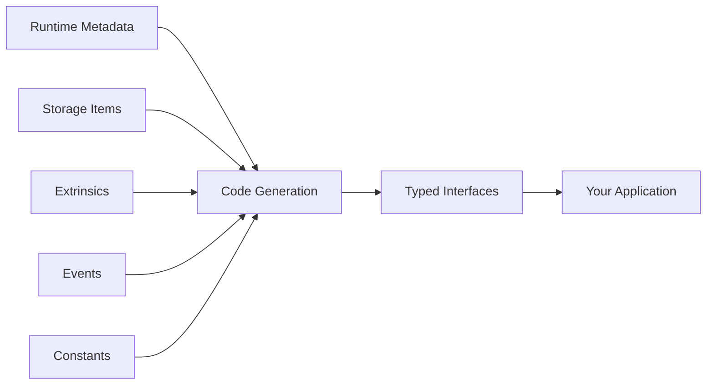

# Typed Metadata System

**Apex SDK's typed metadata system provides compile-time type safety for Substrate runtime interactions while maintaining compatibility with runtime upgrades.**

## Overview

The typed metadata system automatically generates Rust types from Substrate runtime metadata, ensuring type-safe interactions with pallets, storage items, and extrinsics. This approach eliminates runtime errors while providing excellent developer experience with IntelliSense and compile-time checks.

## How It Works

### Metadata Generation Process



### Compile-Time Benefits

- **Type Safety** - Catch errors at compile time, not runtime
- **IntelliSense** - Complete IDE support with autocomplete
- **Refactoring** - Safe refactoring across runtime changes
- **Documentation** - Auto-generated docs from runtime metadata

## Basic Usage

### Setting Up Typed Metadata

```rust
use apex_sdk::substrate::{SubstrateClient, TypedMetadata};

#[tokio::main]
async fn main() -> Result<(), Box<dyn std::error::Error>> {
    let client = SubstrateClient::builder()
        .endpoint("wss://rpc.polkadot.io")
        .with_typed_metadata(true)
        .build()
        .await?;
    
    // Metadata is automatically fetched and types generated
    let metadata = client.metadata().await?;
    
    Ok(())
}
```

### Accessing Typed Storage

```rust
use apex_sdk::polkadot::runtime_types::*;

// Type-safe storage access
let account_info = client
    .storage()
    .system()
    .account(&account_id, None)
    .await?;

match account_info {
    Some(info) => {
        println!("Nonce: {}", info.nonce);
        println!("Free balance: {}", info.data.free);
        println!("Reserved balance: {}", info.data.reserved);
    }
    None => println!("Account not found"),
}

// Iterator over storage maps
let all_accounts = client
    .storage()
    .system()
    .account_iter(None)
    .await?;

for (account_id, account_info) in all_accounts.take(10) {
    println!("Account: {:?}, Balance: {}", account_id, account_info.data.free);
}
```

### Type-Safe Extrinsics

```rust
use apex_sdk::polkadot::runtime_types::*;

// Construct type-safe extrinsics
let transfer_call = polkadot::balances::calls::TransferKeepAlive {
    dest: MultiAddress::Id(recipient_account_id),
    value: 1_000_000_000_000u128, // 1 DOT
};

let extrinsic = client
    .tx()
    .balances()
    .transfer_keep_alive(transfer_call.dest, transfer_call.value)
    .build()?;

// Sign and submit
let hash = client
    .submit_extrinsic(&extrinsic, &signer)
    .await?;

println!("Transaction submitted: {:?}", hash);
```

## Advanced Features

### Event Monitoring with Types

```rust
use apex_sdk::polkadot::runtime_types::*;

// Subscribe to typed events
let mut events = client.events().subscribe().await?;

while let Some(event_details) = events.next().await {
    let events = event_details?;
    
    for event in events.iter() {
        let event = event?;
        
        // Pattern match on typed events
        match event.pallet_name().as_str() {
            "Balances" => {
                if let Ok(balance_event) = event.as_event::<balances::Event>() {
                    match balance_event {
                        balances::Event::Transfer { from, to, amount } => {
                            println!("Transfer: {} -> {} ({})", from, to, amount);
                        }
                        balances::Event::Deposit { who, amount } => {
                            println!("Deposit: {} ({})", who, amount);
                        }
                        _ => {}
                    }
                }
            }
            "System" => {
                if let Ok(system_event) = event.as_event::<system::Event>() {
                    match system_event {
                        system::Event::ExtrinsicSuccess { dispatch_info } => {
                            println!("Extrinsic succeeded: {:?}", dispatch_info);
                        }
                        system::Event::ExtrinsicFailed { dispatch_error, dispatch_info } => {
                            println!("Extrinsic failed: {:?}", dispatch_error);
                        }
                        _ => {}
                    }
                }
            }
            _ => {}
        }
    }
}
```

### Custom Pallet Integration

```rust
// Define custom pallet types
mod my_custom_pallet {
    use super::*;
    
    #[derive(Debug, Clone, PartialEq, Eq, Encode, Decode, TypeInfo)]
    pub enum Call {
        #[codec(index = 0)]
        CustomFunction {
            param1: u32,
            param2: Vec<u8>,
        },
    }
    
    #[derive(Debug, Clone, PartialEq, Eq, Encode, Decode, TypeInfo)]
    pub enum Event {
        #[codec(index = 0)]
        CustomEvent {
            account: AccountId,
            value: u128,
        },
    }
}

// Use custom types
let custom_call = my_custom_pallet::Call::CustomFunction {
    param1: 42,
    param2: b"custom_data".to_vec(),
};

let extrinsic = client
    .tx()
    .create_extrinsic("MyCustomPallet", "custom_function", custom_call)
    .build()?;
```

### Storage Queries with Pagination

```rust
use apex_sdk::substrate::storage::{StorageKey, StorageIterator};

// Paginated storage iteration
async fn get_all_validators(client: &SubstrateClient) -> Result<Vec<ValidatorPrefs>, Error> {
    let mut validators = Vec::new();
    let mut iter = client
        .storage()
        .staking()
        .validators_iter(None)
        .await?;
    
    // Process in chunks to avoid memory issues
    while let Some(chunk) = iter.next_chunk(100).await? {
        for (validator_id, prefs) in chunk {
            validators.push(prefs);
        }
    }
    
    Ok(validators)
}
```

## Runtime Compatibility

### Handling Runtime Upgrades

```rust
use apex_sdk::substrate::{RuntimeVersion, MetadataCompatibility};

// Check runtime compatibility
async fn ensure_compatibility(client: &SubstrateClient) -> Result<(), Error> {
    let runtime_version = client.rpc().state_get_runtime_version(None).await?;
    let metadata = client.metadata().await?;
    
    let compatibility = MetadataCompatibility::check(
        &runtime_version,
        &metadata,
        &client.stored_metadata()
    ).await?;
    
    match compatibility {
        MetadataCompatibility::Compatible => {
            println!("Runtime is compatible");
        }
        MetadataCompatibility::UpdateRequired => {
            println!("Updating metadata...");
            client.refresh_metadata().await?;
        }
        MetadataCompatibility::Breaking(changes) => {
            eprintln!("Breaking changes detected: {:?}", changes);
            return Err(Error::IncompatibleRuntime(changes));
        }
    }
    
    Ok(())
}
```

### Version Handling

```rust
#[derive(Debug)]
pub struct VersionedClient {
    client: SubstrateClient,
    runtime_version: RuntimeVersion,
}

impl VersionedClient {
    pub async fn new(endpoint: &str) -> Result<Self, Error> {
        let client = SubstrateClient::builder()
            .endpoint(endpoint)
            .build()
            .await?;
            
        let runtime_version = client.rpc().state_get_runtime_version(None).await?;
        
        Ok(Self {
            client,
            runtime_version,
        })
    }
    
    pub async fn ensure_compatible(&mut self) -> Result<(), Error> {
        let current_version = self.client.rpc().state_get_runtime_version(None).await?;
        
        if current_version.spec_version != self.runtime_version.spec_version {
            println!("Runtime upgrade detected: {} -> {}", 
                self.runtime_version.spec_version,
                current_version.spec_version
            );
            
            self.client.refresh_metadata().await?;
            self.runtime_version = current_version;
        }
        
        Ok(())
    }
}
```

## Performance Optimization

### Caching Strategy

```rust
use apex_sdk::substrate::cache::{MetadataCache, StorageCache};

// Configure intelligent caching
let client = SubstrateClient::builder()
    .endpoint("wss://rpc.polkadot.io")
    .with_metadata_cache(MetadataCache::new()
        .with_ttl(Duration::from_hours(24))
        .with_size_limit(100 * 1024 * 1024) // 100MB
    )
    .with_storage_cache(StorageCache::new()
        .with_ttl(Duration::from_secs(30))
        .with_size_limit(50 * 1024 * 1024) // 50MB
    )
    .build()
    .await?;
```

### Batch Operations

```rust
use apex_sdk::substrate::batch::{BatchRequest, BatchQuery};

// Batch multiple storage queries
let batch = BatchQuery::new()
    .add_storage_query(system::storage::account(&account1))
    .add_storage_query(system::storage::account(&account2))
    .add_storage_query(staking::storage::validators(&validator))
    .add_constant_query(balances::constants::existential_deposit());

let results = client.batch_query(batch).await?;

// Process results with type safety
for result in results {
    match result {
        BatchResult::Account(account_info) => {
            println!("Account balance: {}", account_info.data.free);
        }
        BatchResult::Validator(validator_prefs) => {
            println!("Validator commission: {}%", validator_prefs.commission.deconstruct());
        }
        BatchResult::Constant(existential_deposit) => {
            println!("Existential deposit: {}", existential_deposit);
        }
        _ => {}
    }
}
```

## Error Handling

### Dispatch Error Types

```rust
use apex_sdk::substrate::errors::{DispatchError, ModuleError};

async fn handle_transaction_error(result: Result<H256, DispatchError>) {
    match result {
        Ok(tx_hash) => {
            println!("Transaction successful: {:?}", tx_hash);
        }
        Err(DispatchError::Module(module_error)) => {
            match (module_error.pallet.as_str(), module_error.error.as_str()) {
                ("Balances", "InsufficientBalance") => {
                    eprintln!("Insufficient balance for transaction");
                }
                ("Staking", "AlreadyBonded") => {
                    eprintln!("Account is already bonded");
                }
                (pallet, error) => {
                    eprintln!("Module error in {}: {}", pallet, error);
                }
            }
        }
        Err(DispatchError::BadOrigin) => {
            eprintln!("Invalid transaction origin");
        }
        Err(DispatchError::CannotLookup) => {
            eprintln!("Cannot lookup account");
        }
        Err(other) => {
            eprintln!("Other dispatch error: {:?}", other);
        }
    }
}
```

## Custom Types and Codegen

### Generating Types for Custom Runtime

```rust
// Generate types for custom runtime
use apex_sdk::codegen::{CodeGenerator, GeneratorConfig};

async fn generate_custom_types() -> Result<(), Error> {
    let client = SubstrateClient::builder()
        .endpoint("wss://my-custom-node.com")
        .build()
        .await?;
    
    let metadata = client.metadata().await?;
    
    let generator = CodeGenerator::new(GeneratorConfig {
        output_dir: "./src/generated".into(),
        module_name: "my_runtime".into(),
        derive_traits: vec!["Debug", "Clone", "PartialEq", "Eq"],
        generate_docs: true,
    });
    
    generator.generate_from_metadata(&metadata).await?;
    
    println!("Types generated successfully!");
    Ok(())
}
```

### Custom Derive Macros

```rust
use apex_sdk::derive::{SubstrateType, StorageEntry};

#[derive(SubstrateType, Debug, Clone)]
pub struct CustomStruct {
    pub field1: u32,
    pub field2: Vec<u8>,
    pub field3: Option<AccountId>,
}

#[derive(StorageEntry)]
pub struct MyStorage {
    #[storage(key)]
    pub account: AccountId,
    #[storage(value)]
    pub data: CustomStruct,
}
```

## Best Practices

### Type Safety Guidelines

1. **Always use generated types** - Avoid raw codec operations
2. **Handle version compatibility** - Check for runtime upgrades
3. **Use batch operations** - Minimize RPC calls
4. **Implement proper error handling** - Handle all dispatch error types
5. **Cache metadata appropriately** - Balance freshness and performance

### Performance Tips

1. **Reuse client instances** - Avoid creating multiple connections
2. **Use storage iterations wisely** - Implement pagination for large datasets
3. **Monitor metadata size** - Large runtimes can impact memory usage
4. **Implement circuit breakers** - Handle network failures gracefully

### Development Workflow

1. **Generate types early** - Include type generation in build process
2. **Test with multiple runtime versions** - Ensure compatibility
3. **Use typed examples** - Document usage with real types
4. **Monitor breaking changes** - Track runtime upgrade impacts

## Migration Guide

### From Raw Codec

```rust
// Before: Raw codec operations
let encoded = Encode::encode(&my_call);
let result = client.rpc().author_submit_extrinsic(encoded).await?;

// After: Typed operations
let extrinsic = client
    .tx()
    .my_pallet()
    .my_call(param1, param2)
    .build()?;
let result = client.submit_extrinsic(&extrinsic, &signer).await?;
```

### From Manual Type Definitions

```rust
// Before: Manual type definitions
#[derive(Encode, Decode)]
struct ManualCall {
    param: u32,
}

// After: Generated types
use crate::my_runtime::my_pallet::calls::MyCall;
let call = MyCall { param: 42 };
```

## Resources

- [Substrate Type System Documentation](https://docs.substrate.io/reference/scale-codec/)
- [Polkadot Runtime Types](https://paritytech.github.io/substrate/master/)
- [Custom Runtime Development](/docs/substrate)
- [Performance Optimization Guide](/docs/testing)